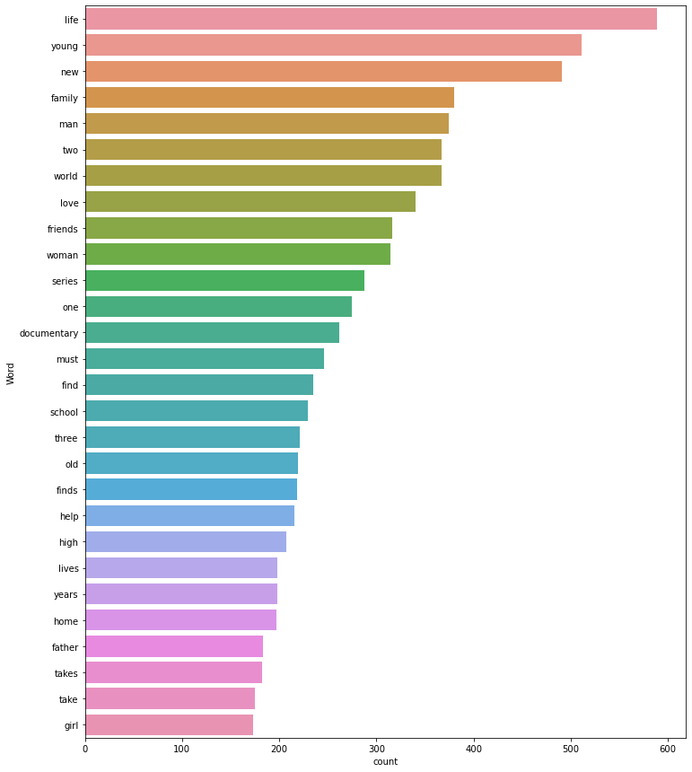
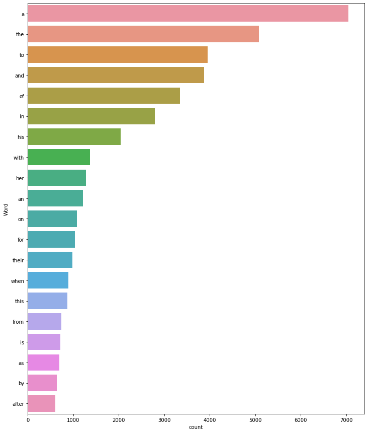

# [The Big Chill](https://the-big-chill.herokuapp.com/)

## Project to apply Machine Learning (ML) to Netflix tv shows & movies
**APPLICATION PURPOSE: Do you have a TV show or movie about to premier on Netflix!?!**  
- The description of your tv show or movie is an important part of the information people are presented with when scrolling through the numerous options to select as they sit back to “Netflix & chill”.
- User can enter tv show or movie description to predict that description’s rating & OMDB genre. 
>- This application can help you optimize the description you supply Netflix to ensure the person picks the expected genre & movie rating of your movie or tv show.
>- Underlying Database provides a way to explore/analyze the Netflix shows and movies by genre and rating to find something to watch on Netflix.  Data manipulated through ML to identify similar content by matching text-based features. 

- **Table of Contents:**
>- [Machine Learning](#machine-learning)
>- [Flask](#flask)
>- [Heroku Deployment](#heroku-deployment)
>- [Other Data Analysis](#Other-Data-Analysis)
>- [Extract Transform Load (ETL)](#Data-Extract-Transform-Load-(ETL))
>- [Data Sources](#data-sources)
>- [Team Members](#team-members)
>- [Technologies Used](#technologies-used)

## **Application Diagram**
    **STILL NEED TO ADD database model**

## **Machine Learning**
- Machine Learning (ML) library used = OneVsRestClassifier (sklearn.multiclass)
- TV Show or Movie Description is input to predict one of
>>- 28 OMDB genre (The most common genre is Drama, which causes our predictions to be a bit unbalanced):
>>  
>>- Grouped to 5 ratings = G, PG, PG-13, R, NC-17:
>>>- Grouped to G: ‘TV-Y7’ , ’TV-G’ , ’TV-Y’ , ’TV-Y7-FV’
>>>- Grouped to R: 'TV-MA’ & 'R'
>>  
- Common Description Words:  Finding the right words to train your machine on is key. 
>> 
>> 
>- Picking valuable words like "young" will give more desirable results rather than "the"
>- Library nltk.corpus used to remove ‘standard’ stopwords (top words removed = a, the, to, and)
>>  
- trained genre on 99% of the data & ratings on 88% of the data; train %s high due to limited records
- Saved model to refrence model through Flask using Pickle
- Predictive Accuracy for genre = 43.5%
- Predictive Accuracy for ratings = 35.2% 

## **Flask**
- Saved machine learning (ML) model & referenced in Flask using Pickle (.pkl)
- Used Pandas to merge datbase tables as needed to pull data from Postgresql database
- FireFox application utilized to develop API in order to render the data to the HTML

## **Heroku Deployment**
- Use rquirements text file to load only the python libraries used in the app (ie make sure included Pickle)
- Limited to 10,000 records for Heroku database, used AWS RDS for database server
- Add config with user name & password in Heroku & create variable to reference in app.py Flask to keep senstive information masked
- Deploy using Gethub master branch
- Include 'Procfile' in repository to connect to Heroku app (web: gunicorn app:app)
- Deployed site address: https://the-big-chill.herokuapp.com/

## **Other Data Analysis**
>  
>  
>  
>  
>  
>  

## **Data Extract Transform Load (ETL)**
### ETL Summary
- Extract - We will be using two datasets. We are using a Netflix Movies and TV Shows csv file from Kaggle and using the OMDB API (OMDBAPI.com).
- Transform -  We will pull from the OMDB API titles, ratings, genres, etc. and using the csv netflix file, denoting if the title is in Netflix.
- Load - We will create the database in postgreSQL

### **E**xtract
- From the OMDB source we cleaned the "NA" string to blank
- If it wasn't a Movie, the API didn't have a boxoffice field. We had to create an if statement in the code to account for that
- Each API key only allowed 1000 pulls per day and we had over 6000 pulls. We had to manage multiple API keys in a list and loop through to not exceed 1000 per key. 

### **T**ransform
- The API pull jupyter notebook exported a CSV. The Transform_Load.ipynb pulled the two CSV files and then merged them. We dropped the "listed_in", "genre", and "language" columns that were not a one-to-one to the title and created separate tables for those with a junction table.
- The "imdbVotes" column was stripped of the commas and turned into an integer 
- The data was pulled into a dataframe from the CSVs with pandas. Pandas did not recognize the comma delimited strings as a list. We had to use the str.split(',').tolist() function for the "genre", "listed_in", and "language" columns. We did not do this for the "country", "director", and "cast" columns since we were not splitting them into extra tables. 
>>- Removed the NaN values before looping through the "genre", "listed_in" and "language" columns. We looped through to get the unique values into a set. A set was used since we wanted unique values only in the list for each category and we did not need them in a certain order.
- Used python pandas function .explode() to break out the show_id into a row per genre/listed_in or language.
- The tables were merged to get a show_id to OMDB_genre_no, listed_in, language_no & table as the junction tables.

### **L**oad
- The database schema is shown below in the image. We used the main merged "Title" table and then had a OMDB_genre and netflix_genre table along with their junction tables. 
>> 
- The database and tables were initially set up in PostgreSQL, a relational database, since our data was consistent and so we were able to relate tables to make it easier to query.
- The Transform_Load.ipynb file loads the table data into the tables into PostgreSQL
- PostgreSQL was then connected to AWS RDS (for deployement beyond local host).

## **Data Sources**
- Database
>- Public Domain Netflix Movies and TV Shows csv file from Kaggle: https://www.kaggle.com/shivamb/netflix-shows (This dataset consists of tv shows and movies available on Netflix as of 2019)
>- OMDB API http://www.omdbapi.com/
- Other
>- Netflix Research data: https://www.businessofapps.com/data/netflix-statistics/

## **Team Members**
>- **April Lagnevall** [alagnevall](https://github.com/alagnevall)  - Responsibility: HTML/CSS build, Genre predict ML model, js and D3 build to enable ML model in app
>- **Haifa Najdawi** [HaifaNajdawi](https://github.com/HaifaNajdawi)  - Responsibility: Data visualizations & analysis, Machine Learning, API build, AWS RDS set up, and Heroku Deployment
>- **Julia Headlee**  [julieheadlee](https://github.com/julieheadlee) Responsibility: Flask, Ratings predict ML model, js and D3 build to enable ML model in app
>- **Melanie Nolker** [mnolker](https://github.com/mnolker) - Responsibility: Database ETL & project documentation

## **Technologies Used**
>>- flask
>>- flask_cors
>>- matplotlib
>>- models
>>- nltk
>>- numpy
>>- wordcloud
>>- os
>>- pandas
>>- pickle
>>- pprint
>>- psycopg2
>>- re
>>- seaborn
>>- sklearn
>>- sqlalchemy
>>- tqdm
>>- typing
>>- bootstrap
>>- jquery
>>- js.d3
